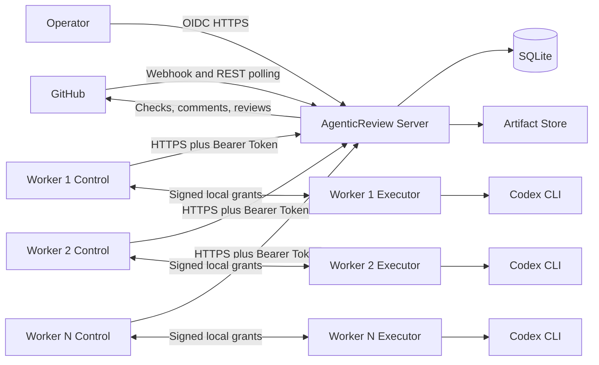
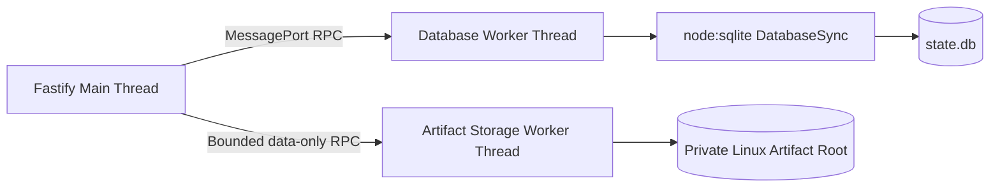

# PowerToys Agentic Review Architecture

Status: Accepted for initial implementation

Last updated: 2026-09-03

## 1. Purpose

PowerToys Agentic Review discovers GitHub issues and pull requests assigned to a configured
reviewer, authorizes the scheduling actor, and dispatches durable review jobs to remote Windows
workers. Workers run Codex CLI and approved validation recipes, while a central server owns
operational state, approvals, and GitHub publication.

Control-plane, dashboard, and Worker orchestration code is TypeScript. The small Windows
ProcessHost and ServiceHost platform adapters are implemented in Go. The server runs on Linux,
Workers run on Windows, and the dashboard uses React and Ant Design Pro.

## 2. Accepted Technology Decisions

| Area | Decision |
|---|---|
| Repository | pnpm TypeScript monorepo |
| Server | Node.js 24 LTS, Fastify 5, Linux |
| Database | Node built-in `node:sqlite` in a dedicated Worker Thread |
| Database topology | One server instance is the only SQLite owner |
| Workers | Remote TypeScript processes on Windows |
| Worker hosting | Two WinSW-managed Windows Services per logical node |
| Process supervision | Native `AgenticReview.ProcessHost.exe` using Windows Job Objects |
| Native adapters | Go 1.24 ProcessHost and ServiceHost, cross-compiled for Windows x64/arm64 |
| Worker transport | Outbound HTTPS with one long-lived Bearer Token per Worker node |
| Queue semantics | Server-issued leases with heartbeats and fencing generations |
| GitHub | Webhooks when available, reconciliation polling always enabled |
| Scheduling authorization | Self or explicit GitHub user/App allowlist, deny unknown actors |
| Dashboard | React 19, Ant Design Pro 6, Umi Max 4, Ant Design 6 |
| API contracts | TypeBox runtime schemas and versioned JSON contracts |
| Observability | Pino structured logs and OpenTelemetry |

The architecture does not use .NET, PostgreSQL, Redis, Hangfire, Quartz, MUI, Material Web, or
direct worker access to SQLite.

## 3. System Context



GitHub is authoritative for issue and pull request state. SQLite is authoritative for local
projections, Worker node credentials and revocation, jobs, attempts, leases, findings, approvals,
publications, and audit history. Git is authoritative for prompts, schemas, validation recipes,
migrations, and non-secret policy.

## 4. Deployment Topology

### 4.1 Linux Server

The server is deployed as one Linux process or one container replica. It owns:

- Fastify HTTP endpoints.
- GitHub App or SSO-authorized user credentials.
- Webhook verification and reconciliation polling.
- The scheduling and actor authorization policy.
- The SQLite database and database Worker Thread.
- Worker credential management, registration, leases, heartbeat processing, and the lease reaper.
- Artifact upload and retention.
- Publication approvals and the GitHub transactional outbox.
- The Ant Design Pro static bundle.

SQLite must use local ext4 or xfs storage. It must not use NFS, SMB, a Git checkout, or an
ephemeral container layer. A SQLite deployment has exactly one active server replica.

### 4.2 Remote Windows Workers

Each logical worker node is implemented by two WinSW services with distinct restricted Windows
identities, as specified by ADR 0007:

- `AgenticReview.Worker.Control` owns the fixed local Worker authentication profile, registration,
  claims, leases, and Server uploads. The standard data path uses a fixed-origin, route-limited
  HTTPS Worker API transport and sends the node's Bearer Token only in the `Authorization` header.
  Control has no checkout, Codex, Git, ProcessHost, or validation-tool access.
- `AgenticReview.Worker.Executor` owns Codex, Git, ProcessHost, validation tools, and disposable
  workspaces. It has no Server, GitHub, database, webhook, or publication credential.

The services exchange typed, signed, short-lived local execution grants over an ACL-restricted
Named Pipe. The Server still sees one `workerNodeId`; a raw Server lease token never enters the
Executor boundary. Each worker machine installs:

- A pinned Node.js 24 LTS runtime.
- The compiled Control and Executor TypeScript worker bundles.
- WinSW for Windows Service integration.
- `AgenticReview.ServiceHost.exe` for the local identity channel, CNG operations used by the local
  capability signer, Control-only fixed-origin HTTPS transport, and service-root Job Object.
- `AgenticReview.ProcessHost.exe` for Job Object supervision.
- A pinned Codex CLI version.
- PowerToys build tools required by its advertised recipes.
- An individual long-lived Worker Bearer Token in the fixed plaintext Control configuration file
  `C:\ProgramData\AgenticReview\Control\worker-auth-v1.json`. The local Windows environment is
  trusted, and the Token is not copied into the Executor boundary, packages, diagnostics, or logs.
- An Executor-specific Codex credential, workload identity, or inference-broker capability.

Workers open outbound connections only. They do not expose inbound HTTP ports and never receive a
GitHub credential, database path, webhook secret, or publication credential.

### 4.3 Dashboard

The dashboard is built with Ant Design Pro and served as static assets by Fastify. It is not a
separate production service. The default route is `/work-items`, not the Ant Design Pro analysis
demo.

## 5. Server Components

The server contains the following logical modules:

- `GitHubWebhookEndpoint`: verifies raw-body HMAC and records deliveries.
- `GitHubPoller`: reconciles assigned issues, assigned PRs, and requested reviews.
- `SchedulingAuthorizer`: validates the GitHub actor against the active policy.
- `WorkItemProjector`: maintains canonical GitHub state and request epochs.
- `JobScheduler`: creates idempotent jobs for immutable revisions.
- `LeaseService`: atomically grants, renews, expires, and fences worker leases.
- `WorkerRegistry`: manages per-node Token state and tracks process instances, capabilities, and
  health.
- `ArtifactService`: accepts bounded, checksummed, resumable uploads.
- `ApprovalService`: creates immutable publication drafts and approvals.
- `GitHubPublisher`: processes an idempotent outbox and reconciles uncertain writes.
- `DatabaseClient`: provides asynchronous RPC to the database Worker Thread.
- `MaintenanceService`: runs backups, retention, WAL checkpoints, and reapers.

## 6. Database Architecture

The Fastify main thread never opens SQLite. A dedicated Node Worker Thread owns one
`DatabaseSync` instance from `node:sqlite`.



The production Server lifecycle adopts Fastify, background tasks, the artifact transaction
coordinator, both Worker Threads, SQLite, and the process-lifetime database owner lock. Readiness is
published only after the first bounded artifact reconciliation sweep. Shutdown first closes global
admission and aborts background scheduling, then drains Fastify and background database requests,
proves artifact Worker exit, closes SQLite, and releases the owner lock. A fatal artifact integrity,
protocol, or unknown-outcome condition follows the same ordered drain and then exits the complete
Server with a nonzero status.

For artifact operations, `ServerStorageRuntime` exposes Fastify only to two frozen narrow ports: a
four-method create/chunk/finalize/terminate transaction port and a separate single-method completion
port. The application registers those artifact routes and the shared run-completion route while
receiving artifact health only through a separate boolean readiness probe. Neither port carries
arbitrary object-read, coordinator shutdown, fatal, or owner capabilities. These routes are live,
but claim selection remains default-off: production claims still bind `inline_result_v1` and the
database prepare rejects artifact upload or completion before capacity admission, filesystem
mutation, or immutable-object reads. A later reviewed rollout must version the claim envelope and
atomically persist `result_artifact_v1`; route availability alone grants no artifact mode.

The database thread applies:

```sql
PRAGMA journal_mode = WAL;
PRAGMA synchronous = FULL;
PRAGMA foreign_keys = ON;
PRAGMA trusted_schema = OFF;
PRAGMA busy_timeout = 5000;
```

Schema changes are immutable SQL files recorded in `schema_migrations` with a version, filename,
checksum, and application timestamp. The server backs up the database before applying migrations
and does not become ready when migration validation fails.

All lease and outbox mutations use prepared statements and short `BEGIN IMMEDIATE` transactions.
GitHub calls, Codex calls, schema validation, and artifact I/O never run inside a SQLite
transaction.

`node:sqlite` is currently a Node.js release-candidate API. The deployment pins an exact Node.js
patch and image digest. Every Node upgrade requires database contract, migration, concurrency, and
backup verification before rollout.

## 7. Worker Registration and Capabilities

A worker has a stable Server-generated `workerNodeId`, a new `workerInstanceId` for every Control
payload start, and a new local Executor boot ID for every Executor payload start. WinSW recovery
that restarts either Node payload changes the corresponding ID; a pipe reconnect without a process
restart does not.

Any authenticated Dashboard user may create, rotate, or revoke a Worker credential. Creation
produces one node-specific 256-bit Bearer Token and a `pending` database record. The Server returns
the plaintext Token only once and stores only its lowercase SHA-256 digest. The first valid
registration transitions the node from `pending` to `active`; an explicit revocation transitions a
`pending` or `active` node to terminal `revoked`. Rotation replaces the digest atomically without an
overlap window. Request bodies may assert `workerNodeId`, but cannot override the identity derived
from the Token.

The Worker Token is long-lived until rotation or revocation and is stored in the fixed canonical
plaintext Control configuration file. Restoring an older Server database backup intentionally
restores the credential state in that backup, including the accepted risk that an older Token or a
later-revoked credential can become valid again.

Registration reports:

- Worker and protocol versions.
- Operating system and architecture.
- Maximum execution slots.
- Codex CLI version.
- Supported validation recipe IDs and versions.
- Toolchain capabilities.
- Whether an interactive desktop is available.

Headless Windows Services report `interactiveDesktop: false`. A future GUI worker must run in an
interactive user session and advertise a separate capability.

## 8. Lease and Heartbeat Protocol

Workers long-poll the server for work. Claiming a job creates a `RunAttempt` and an expiring lease
inside one SQLite transaction.

Every lease contains:

- A random 256-bit token. SQLite stores only its hash.
- A monotonically increasing fencing generation.
- The worker node and process instance IDs.
- Server-issued lease and execution deadlines.
- The immutable job revision and configuration digests.

Every progress, artifact, completion, and failure request must match the active attempt, worker
instance, token, generation, and unexpired lease. A stale worker receives `409 lease_lost` and must
terminate its local process tree.

Recommended defaults:

| Setting | Value |
|---|---:|
| Worker heartbeat interval | 20 seconds |
| Worker offline threshold | 90 seconds |
| Job heartbeat interval | 20 seconds |
| Job lease TTL | 120 seconds |
| Lease reaper interval | 15 seconds |
| Worker self-abort threshold | 100 seconds without renewal |
| Maximum infrastructure attempts | 3 |

A heartbeat renews all active slots in one request and carries each attempt's phase and progress
sequence. The server clock is authoritative. The worker uses a monotonic local timer only to abort
before its lease can no longer be renewed.

When a lease expires, the current attempt fails with `WORKER_HEARTBEAT_TIMEOUT`. If the job remains
current and eligible and has attempts remaining, it enters `RetryWaiting` and becomes claimable
later. Otherwise it enters `Failed` or `DeadLetter`.

The system guarantees one server-recognized lease, not exactly-once physical execution. A worker
isolated by a network partition may run briefly after a replacement starts, but fencing prevents
its results from committing. Workers self-terminate after renewal failure to minimize overlap.

## 9. Worker API

The worker plane is available only over HTTPS and authenticates each request with the node's Bearer
Token. A `pending` Token may call only the registration endpoint; every other Worker route requires
an `active` node. The Server checks the database on every request and fails closed when the
authentication database is unavailable. Workers require no inbound endpoint.

```text
POST /api/v1/worker/instances
PUT  /api/v1/worker/instances/{instanceId}/heartbeat
POST /api/v1/worker/leases/claim
POST /api/v1/worker/runs/{runId}/events:batch
POST /api/v1/worker/runs/{runAttemptId}/artifacts
PUT  /api/v1/worker/artifact-uploads/{uploadId}/chunks/{chunkIndex}
POST /api/v1/worker/artifact-uploads/{uploadId}/complete
POST /api/v1/worker/artifact-uploads/{uploadId}/terminate
POST /api/v1/worker/runs/{runId}/complete
POST /api/v1/worker/runs/{runId}/fail
POST /api/v1/worker/runs/{runId}/release
```

The server returns cancellation, stale-revision, drain, and minimum-version commands in heartbeat
responses. Workers batch progress events and compressed logs. SQLite stores structured milestones
and artifact metadata, not high-frequency JSONL or build output.

## 10. GitHub Ingestion and Scheduling Authorization

Webhooks are used when the GitHub App can be installed. Reconciliation polling remains enabled to
recover missed, delayed, or unavailable webhook events.

The system distinguishes:

- Resource author: `issue.user` or `pull_request.user`.
- Scheduling actor: webhook `sender`, issue event `assigner`, or `review_requester`.
- Scheduling target: `assignee` or `requested_reviewer`.

Scheduling is authorized by immutable GitHub user or App IDs. Login names are display snapshots,
not authorization keys. The initial policy is `SelfOrAllowlist`, `unknownActor: Deny`, and
`newRevisionPolicy: InheritAuthorizedRequest`.

An authorized assignment or review request starts a request epoch. New PR revisions inherit the
active authorization even when an untrusted contributor pushes the new commit. Removing the
assignment or review request closes the epoch. A later request creates a new epoch and evaluates
the new actor again.

Webhook signatures are validated over the raw request bytes before JSON parsing. A delivery is
persisted before a success response. Webhook events are synchronization hints; canonical GitHub
REST state determines the final projection and prevents out-of-order updates from winning.

## 11. Job Execution

Workers create a disposable checkout for the exact configured repository and immutable head SHA.
They do not use a developer checkout or a shared writable Git worktree.

Codex is invoked directly without a shell:

```text
codex exec -
--json
--color never
--output-schema <schema-path>
--output-last-message <result-path>
--sandbox read-only
```

The worker streams the prompt over stdin, drains stdout and stderr concurrently, limits every line
and artifact, parses JSONL incrementally, and validates the final result again with Ajv.

Each attempt runs through `AgenticReview.ProcessHost.exe`. The helper creates a Windows Job Object,
starts the target suspended, assigns it to the Job Object, and then resumes it. Lease loss,
cancellation, hard timeout, worker termination, or control-channel failure closes the Job Object
and terminates the complete process tree.

Dynamic validation is requested by recipe ID and typed parameters. A model cannot supply an
executable command. Public fork validation requires explicit per-revision approval because a
fixed build command still executes contributor-controlled build and test code.

## 12. Resumability Across Workers

Codex local session state is not transferred between machines. Structured results are the durable
checkpoint:

1. Any worker creates `PrReviewPlanV1`.
2. Any capable worker executes approved validation recipes.
3. Any worker creates `PrReviewFinalV1` from the plan, validation summaries, and bounded evidence.

`codex exec resume` is an optional optimization only while the same worker retains a continuous
lease and local session. It is not a distributed correctness dependency.

## 13. Artifacts

Workers upload logs and artifacts through bounded, checksummed, resumable sessions. Each chunk and
completed file has a SHA-256 digest. The server validates declared sizes, content types, per-file
limits, per-job quotas, and lease ownership.

Artifact operations are accepted only while the exact lease remains active. A submission after
lease loss is rejected; reconciliation removes any uncommitted staging bytes without creating a
`run_artifacts` record or allowing the data to participate in completion, approval, or publication.
Any future diagnostic retention path must use a separately designed quarantine namespace and must
remain isolated from result artifacts. Workers keep local artifacts until the server acknowledges
finalization, then remove the disposable workspace according to retention policy.

## 14. Approval and GitHub Publication

Agent results are immutable. Operator edits or finding selections create a new publication draft
with a new digest. An approval binds the draft digest, target revision, result digest, prompt and
schema versions, validation recipe versions, publication channel, and GitHub review action.

The approval transaction inserts the approval, creates uniquely keyed outbox records, updates the
job, and appends audit and UI events. GitHub requests occur after the transaction commits.

Before sending, the server refetches the resource and verifies the configured repository, open
state, active assignment or review request, current head SHA, and approval digest. Check Runs use a
stable `external_id`; comments and reviews contain a hidden publication marker. Unknown network
outcomes are reconciled remotely before retry.

Merge, push, branch modification, issue close, and repository administration are outside the
initial publication policy.

## 15. Dashboard

The dashboard uses the full Ant Design Pro engineering model:

- React 19 and TypeScript.
- Ant Design Pro 6 and Umi Max 4.
- Ant Design 6 and project-wrapped Pro components.
- TanStack Query for server state.
- TanStack Virtual for long logs.
- Vitest for component and state tests.
- Playwright for end-to-end tests.

The application retains `ProLayout`, `ProTable`, `ProForm`, `ProDescriptions`, routing, access
control, internationalization, theming, and OpenAPI client generation. Demo analysis, sales,
traffic, account, AI assistant, maps, mock data, and unused chart pages are removed.

Primary routes:

```text
/work-items
/jobs
/workers
/approvals
/publications
/system
```

The default view prioritizes items needing attention, active runs, approvals, failures, workers,
recent completions, and system health. The Ant Design Pro analysis demo is a component and layout
reference, not the product information architecture.

The Pro components v3 prerelease line is pinned exactly and wrapped by project components. The
lockfile is mandatory, and dependency upgrades require UI contract and end-to-end verification.

## 16. Security Boundaries

- The server owns GitHub credentials and never sends them to workers.
- Every worker has an individual long-lived Bearer Token and an Executor Codex identity, held by
  separate Control and Executor service identities respectively.
- The Control transport validates the Server HTTPS certificate, is limited to the configured Server
  origin and Worker routes, and cannot reach arbitrary hosts or routes.
- Worker identity comes from the database mapping of the Bearer Token digest, not request JSON or
  source IP. SQLite stores no plaintext Worker Token.
- A pending Worker credential may register exactly its Server-generated node identity; active and
  revoked states are enforced independently of process-instance state.
- Any authenticated Dashboard user has equal authority to create, rotate, and revoke Worker
  credentials. Database-backup rollback of that state is an explicitly accepted risk.
- Lease tokens authorize one attempt and cannot authorize publication.
- Workers cannot access SQLite, approval state, or the GitHub outbox.
- Repository, issue, PR, and artifact content is untrusted input.
- Worker environments exclude GitHub, SSH, cloud, package-manager, and unrelated credentials.
- Public fork build and test execution requires explicit approval.
- Dashboard authorization is enforced by server policy, not only route visibility.
- Secrets are never stored in SQLite, prompts, logs, job envelopes, or Git.

The Linux server uses an approved secret store, container secrets, or systemd credentials for its
remaining deployment credentials. The Worker Bearer Token is intentionally stored as plaintext in
the fixed Control configuration file because the local Windows environment is trusted; it still
must not enter source control, packages, diagnostics, logs, command-line arguments, or environment
variables. The local Control-to-Executor capability signer and package/Authenticode signing remain
separate key boundaries.

## 17. Observability

Pino emits structured JSON logs. OpenTelemetry records HTTP, GitHub, database RPC, lease, Codex,
validation, and publication spans and metrics. Every record uses available correlation fields:

```text
repositoryId
workItemId
jobId
runAttemptId
workerNodeId
workerInstanceId
leaseGeneration
githubDeliveryId
headSha
```

Codex JSONL and build output are artifacts, not application log events. Logs never contain tokens,
private keys, complete prompts, authorization headers, or unbounded webhook bodies.

## 18. Repository Layout

```text
apps/
  server/
  worker/
  dashboard/
packages/
  contracts/
  domain/
  github/
  codex/
  configuration/
  observability/
config/
  prompts/
  schemas/
  recipes/
  policies/
migrations/
native/
  process-host/
tests/
  unit/
  integration/
  contract/
  concurrency/
  e2e/
deploy/
  server/
  worker/
  pki/
docs/
  adr/
```

Dependency rules:

- The dashboard depends on browser-safe contracts and generated API clients.
- The worker depends on contracts, domain, Codex, configuration, and observability.
- The server depends on contracts, domain, GitHub, configuration, and observability.
- Only server database code imports `node:sqlite` and migrations.
- Only server GitHub code imports GitHub authentication and write clients.
- Domain and contracts do not depend on Fastify, SQLite, Octokit, React, or Node-only APIs.

## 19. Deployment

The Linux server is deployed with systemd or as a single-replica container using a persistent local
volume for SQLite, artifacts, and backups. The dashboard build is copied into the server image and
served by Fastify.

Each Windows worker is installed as two WinSW-managed Windows Services under distinct restricted,
non-administrator identities. Executor starts first; Control begins claiming only after their local
identity, protocol, package, ACL, sandbox, and credential preflight succeeds. Control enters drain
mode before upgrade and stops claiming before either executable bundle is replaced. Production
execution fails closed unless the split-service boundary in ADR 0007 is active.

Server upgrades pause claims, create a database backup, apply checked SQL migrations, start the new
server, run reconciliation, and then resume claims. Restoring a backup also restores its Worker
Token hashes and `pending`/`active`/`revoked` state; anti-rollback protection is not part of this
trust model. Worker and protocol versions are advertised at registration; the server can require a
minimum compatible version.

## 20. Initial Delivery Plan

Phase 1a is the completed authenticated read-only slice. Worker execution enablement and the
remaining product data path proceed as separate ordered tracks: the Worker track moves from a
TypeScript zero-slot shadow runtime to release and installation, then native Windows verification;
the product track moves from result artifacts to immutable diff validation, publication drafts and
approvals, the GitHub outbox, and Dashboard write actions.

### Phase 0: Foundation

- Monorepo, contracts, domain state, configuration, and observability.
- Database Worker Thread and initial SQL migration.
- Worker registration, atomic claim, heartbeat, fencing, and reaper.
- Windows worker service skeleton and ProcessHost protocol boundary.
- Ant Design Pro shell and core routes.

### Phase 1a: Authenticated Read-Only Review

- GitHub polling and optional webhook ingestion.
- Actor authorization and request epochs.
- Static-review execution components and disposable exact-revision workspaces.
- Immutable result projections and authenticated read-only Dashboard views.

### Phase 1b: Review Product Data

- Bounded result-artifact upload, storage, integrity, and retention.
- Immutable server-side diff manifests and finding-location validation.
- Immutable publication drafts, digest-bound approvals, and audit records.

### Windows Zero-Slot Shadow Runtime

- Install the TypeScript Control and Executor business supervisors behind their existing role
  entrypoints and complete authenticated handshake, `Ready`, reconnect, drain, and preflight flows.
- Keep `executionEnabled=false`, advertise zero slots, and reject Claim before dispatcher ownership.
- Build the production release profile, signed package, and dual-service installer only after the
  shadow runtime is complete.
- Run the ADR 0007 native Windows x64 and arm64 verification and attack suite before enabling any
  Claim authority.

### Phase 2: Validation and Publication

- Versioned validation recipes and trust policy.
- Final review synthesis on any worker.
- GitHub comments, reviews, and optional Check Runs through the outbox.
- Remote-write reconciliation and failure recovery.
- Dashboard approval, publication, retry, cancellation, and worker-drain actions.

### Phase 3: Hardening

- Worker Token provisioning, rotation, revocation, and recovery exercises.
- Backup and restore exercises.
- Multi-worker concurrency and fault-injection verification.
- Worker upgrade and drain automation.
- Security review for public fork validation.

## 21. References

- Node.js SQLite: https://nodejs.org/docs/latest-v24.x/api/sqlite.html
- Fastify: https://fastify.dev/
- GitHub webhook payloads: https://docs.github.com/en/webhooks/webhook-events-and-payloads
- Codex non-interactive mode: https://learn.chatgpt.com/docs/non-interactive-mode
- Windows services: https://learn.microsoft.com/en-us/windows/win32/services/services
- Windows Job Objects: https://learn.microsoft.com/en-us/windows/win32/procthread/job-objects
- WinSW: https://github.com/winsw/winsw
- Ant Design Pro: https://github.com/ant-design/ant-design-pro
- Umi Max: https://umijs.org/docs/max/introduce
