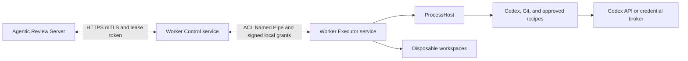

# ADR 0007: Isolate Windows Worker Control and Execution Identities

- Status: Accepted
- Date: 2026-08-31

## Context

The initial Windows Worker process owns the Server mTLS private key, lease tokens, and Codex
execution lifecycle. If it launches Codex and ProcessHost under the same Windows identity, a
model-controlled command or a compromised execution process shares a security principal with the
control-plane credentials. File ACLs and environment filtering do not create a security boundary
between processes running with the same token.

Codex static review is not equivalent to passive file parsing. Repository text is untrusted and can
influence the model, and Codex can use a shell to inspect a checkout. The official Codex GitHub
Action guidance states that `read-only` prevents file changes and network use but still runs with
elevated privileges, and explicitly warns not to rely on `read-only` alone to protect secrets. The
Codex configuration reference also treats `sandbox_mode` and `windows.sandbox` as command sandbox
controls, not as a replacement for host credential isolation.

The Job Object implemented by ProcessHost bounds process lifetime, process count, memory, and
output. It is not a credential or hostile-code isolation boundary. A production Worker therefore
must not enable real execution while the control plane and execution plane share one Windows
identity.

## Decision

Represent one physical Windows machine as one logical Worker node, but install two independently
supervised WinSW services with different Windows identities:

- `AgenticReview.Worker.Control` owns Server communication, mTLS, registration, claims, lease
  renewal, fencing, and result upload. It cannot read execution workspaces, Codex state, Codex
  credentials, Git binaries, or ProcessHost binaries, and cannot launch repository-facing tools.
- `AgenticReview.Worker.Executor` owns disposable checkouts, Codex, Git, ProcessHost, validation
  tools, resource budgets, and cleanup. It has no Server mTLS key, Server bearer credential, GitHub
  App credential, publication credential, webhook secret, database access, or raw Server lease
  token.

The Server sees only the Control service. It continues to identify the machine by one stable
`workerNodeId` and each Control start by a new `workerInstanceId`. Registration also reports the
Executor boot ID, local protocol version, installation-manifest digest, and preflight status as
capability metadata. These fields do not create a second schedulable Worker.

The services communicate with each other only through one local, ACL-restricted Windows Named
Pipe. Control sends typed, signed, short-lived execution capabilities instead of forwarding the
Server lease token. Executor streams bounded progress, artifacts, and terminal results back over
the same pipe. Each ServiceHost also owns one separate, per-launch HostControl pipe used only by its
own Node child; that private bootstrap/RPC channel is not an inter-service transport.

`WORKER_EXECUTION_ENABLED=true` is invalid in production unless `split-service-v1` isolation and
all preflight checks in this ADR succeed. The current single-process mode may remain available for
contract development with execution disabled; it is not a production fallback.

This ADR supersedes ADR 0004 only where ADR 0004 describes one Worker service identity. ADR 0004's
WinSW hosting, ProcessHost, Job Object, drain, and headless-execution decisions remain in force for
the Executor service.

## Security Objective and Threat Model

The design assumes repository content, issue text, pull request diffs, Codex output, shell commands,
and files created in an attempt workspace are hostile. It evaluates every process running with the
Executor SID as outside the Control trust boundary. Under that assumption, an execution-side
attacker must not be able to:

- authenticate to the Agentic Review Server;
- renew, complete, fail, or release a Server lease directly;
- claim another job or manufacture a locally authorized job;
- access GitHub publication or ingestion credentials;
- read the Control mTLS key, Control signing key, Control memory, or Control state;
- change trusted Worker executables, manifests, service configuration, or ACLs; or
- renew local authority after the last signed grant or make a stale result acceptable to the
  Server.

Executor compromise can falsify the result or artifacts of an already authorized attempt and can
consume the resources granted to that attempt. The Server must continue treating Worker output as
untrusted, validating schemas and digests, enforcing fencing, and requiring the configured approval
before publication.

This is primarily a control-plane credential and authorization boundary, not a VM boundary. A
Codex or recipe tree launched by ProcessHost remains in a non-breakaway Job Object and is terminated
when that Job closes. A complete arbitrary-code compromise of the trusted Executor coordinator can
still cause denial of service or local persistence within the restricted Executor account. It
cannot make that process a valid Control peer or commit a fenced result. Environments that require
containment of an Executor-coordinator compromise need a disposable VM or equivalent stronger
boundary.

Local Administrators, `SYSTEM`, kernel compromise, malicious trusted installers, and compromise of
the Agentic Review Server or the selected Codex credential broker are outside this boundary. They
remain operational security concerns. The design intentionally does not use Hyper-V. Public-fork
dynamic build or test execution remains separately gated because static-review isolation is not a
general hostile-code sandbox.

## Service Identities

The default installation uses two distinct virtual service accounts:

```text
NT SERVICE\AgenticReview.Worker.Control
NT SERVICE\AgenticReview.Worker.Executor
```

Enterprise policy may substitute two dedicated local managed accounts, but the accounts must be
different and must not be domain identities. `LocalSystem`, `LocalService`, `NetworkService`, a
shared user, and an interactive operator account are forbidden. Each service must have a restricted
service SID (`SERVICE_SID_TYPE_RESTRICTED`) and no logon rights beyond what service startup
requires. Installer policy denies interactive logon, Remote Desktop logon, batch logon, and network
logon where applicable. Neither identity is a local Administrator or has debug, impersonation,
token creation, backup, restore, take-ownership, driver, or TCB privileges; any unavoidable baseline
token privilege is documented and verified disabled unless actively required.

On a domain-joined host, a virtual service account can present the computer identity to network
resources. Executor is therefore blocked from SMB, enterprise intranet, and Windows integrated
authentication destinations by egress policy. If that policy cannot be enforced, the deployment
must use two dedicated local accounts instead of virtual service accounts.

The installation uses service SIDs, not localized account names, in ACLs. It records the resolved
SIDs at installation and verifies the same SIDs at every startup. A service identity change makes
the Worker non-executable until an administrator reprovisions the ACLs and credentials.

The trusted service bootstrap applies explicit process security descriptors to its TypeScript
payload. The peer service SID has no process-memory, handle-duplication, token-duplication, or thread
control access. Default same-machine process and token ACLs are not the sole enforcement mechanism.

### Native service bootstrap

Node.js does not expose all Windows primitives required here, including exact Named Pipe security
attributes, endpoint PID checks, token inspection, and restricted handle inheritance. Each WinSW
service therefore launches a small signed `AgenticReview.ServiceHost.exe` as its direct child. The
ServiceHost is a Go platform adapter, not a Node addon and not a third Windows service. It contains
no scheduling, lease, repository, prompt, result, or publication policy.

ServiceHost performs only these duties:

- own or connect the ACL-restricted Named Pipe and verify its peer ServiceHost;
- create a private per-launch HostControl pipe, bind its only client to the exact Node child, and
  expose a role-local typed native RPC endpoint over that channel;
- on Control, use the non-exportable CNG client-certificate key through a fixed-origin,
  route-limited mTLS Worker API transport and sign dedicated local-authority prehashes requested by
  the trusted Control payload;
- start one pinned Node executable and one pinned TypeScript bundle with an explicit inherited
  handle list and a replacement environment;
- relay bounded, framed bytes between the Node payload and the verified local Named Pipe session;
- apply process and token DACLs before resuming the Node payload; and
- place the Node payload and all descendants in a non-breakaway service-root Job Object with
  `KILL_ON_JOB_CLOSE`.

Before opening the application channel, each ServiceHost applies an object DACL that grants the peer
SID `PROCESS_QUERY_LIMITED_INFORMATION | SYNCHRONIZE` and a token-object DACL that grants
`TOKEN_QUERY` only. `SYNCHRONIZE` is required to retain and wait on the verified peer lifetime; it
does not grant process-memory or process-control access. The DACL does not grant handle duplication,
token duplication, token assignment, impersonation, adjustment, or thread-control rights.

Each Node payload uses its inherited stdin/stdout anonymous pipes exclusively for the ARWX stream
that ServiceHost relays to the verified inter-service Named Pipe. Role-local bootstrap and RPC use a
separate byte-mode HostControl Named Pipe. ServiceHost creates its only instance before launching
Node with `FILE_FLAG_FIRST_PIPE_INSTANCE`, a protected own-service DACL, and remote-client rejection.
The pipe has a random 256-bit leaf name, but the name is not treated as a credential. After connect,
ServiceHost observes the kernel-reported client PID around checks against the retained Node process
handle, including liveness and stable creation identity. A mismatch, extra connection, framing
failure, or reconnect attempt is host-fatal. Node must connect before it may launch any child.

The inherited ARWX handles and the HostControl connection are not inherited by Codex, Git,
ProcessHost, recipes, or any other child. Executor's ProcessHost Job Objects are nested inside the
Executor service-root Job Object.
ServiceHost is the sole long-lived owner of the root Job handle and never leaks it to Node. Process
exit closes that handle automatically. Parent-child lineage alone does not make WinSW exit close a
child-owned handle, so ServiceHost also retains and continuously waits on a stable handle to its
verified WinSW wrapper. A wrapper signal or service-stop path immediately terminates the root Job,
waits for zero active processes, closes the Job handle, and exits. This bounds even processes
started directly by the Executor coordinator. All application contracts and decisions remain
TypeScript.

## Local Topology



Control handles a validated job envelope as opaque untrusted data long enough to authorize and
relay it, but it never checks out repository files, resolves repository paths, imports repository
configuration, or executes the prompt. Result and artifact bytes cross the pipe in bounded frames;
Control does not receive filesystem access to the Executor workspace.

Executor may fetch the configured public repository anonymously. Private-repository support must
use a separately designed read-only source broker; it must not place a GitHub token in Executor.
Executor has no route to the Server Worker API. Control has no route to GitHub content or the Codex
API. Host and enterprise firewalls enforce these destinations in addition to application policy.

## Named Pipe Boundary

### Endpoint and ACL

The Control ServiceHost creates exactly one pipe endpoint before accepting Executor readiness:

```text
\\.\pipe\AgenticReview.Worker.ControlExecutor.v1
```

It uses `FILE_FLAG_FIRST_PIPE_INSTANCE`, message mode, and `PIPE_REJECT_REMOTE_CLIENTS`. The pipe
security descriptor is protected from inheritance and grants:

- full object control to `SYSTEM` and local Administrators;
- the exact Executor service SID receives only the specific `FILE_READ_DATA`, `FILE_WRITE_DATA`,
  required attribute, and `SYNCHRONIZE` rights;
- no client access to the Control SID, authenticated users, interactive users, anonymous users,
  network users, or `Everyone`.

Neither endpoint requests or grants `GENERIC_WRITE` or `FILE_APPEND_DATA`. For Named Pipes,
`FILE_APPEND_DATA` has the same value as `FILE_CREATE_PIPE_INSTANCE`; granting it would let a peer
create another server instance.

The Control ServiceHost owns the pipe object, so an Executor child that shares the Executor SID
cannot become the object owner or change its DACL. Only one verified and accepted Executor peer
connection is accepted. Another Executor process can pass the initial pipe ACL, so the PID and
image checks below are mandatory, and additional or invalid clients are rejected and audited. After
any disconnect, Executor terminates all attempt children before it is allowed to reconnect.

### Mutual peer verification

An ACL alone is insufficient because an Executor child shares the Executor SID and could connect as
a client. Before exchanging job data:

1. Executor ServiceHost obtains the Control WinSW wrapper PID from the Service Control Manager using
   only `SERVICE_QUERY_STATUS`, then obtains the pipe-server ServiceHost PID with
   `GetNamedPipeServerProcessId`.
2. Control ServiceHost obtains the Executor WinSW wrapper PID from the Service Control Manager,
   then obtains the pipe-client ServiceHost PID with `GetNamedPipeClientProcessId`.
3. For each SCM or Named Pipe PID, the verifier reads the source PID, opens
   `PROCESS_QUERY_LIMITED_INFORMATION | SYNCHRONIZE`, reads the source PID again, requires
   `GetProcessId(handle)` to match, verifies the process is active and records its creation time,
   then retains the handle for the full session. SCM PIDs are accepted only in a stable
   `SERVICE_RUNNING` state; paused, startup, and stop-pending states fail closed. Each side requires
   ServiceHost to be the wrapper's direct child. It verifies the exact restricted service SID on the ServiceHost token
   plus the manifest-pinned paths and SHA-256 hashes of the WinSW wrapper, ServiceHost, Node
   launcher, Worker bundle, and protected configuration; PE files must also have the approved
   Authenticode signer. Neither peer impersonates the other. This wrapper-to-ServiceHost check is
   required because SCM reports the WinSW PID, while the Named Pipe APIs report the ServiceHost PID.
4. Both peers exchange random 256-bit nonces, boot IDs, supported protocol ranges, and package
   digests. Control signs the transcript with its non-exportable local capability key. Executor
   verifies the pinned public key installed by the administrator.

The SCM PID, pipe PID, parent relationship, SID, image, and hash checks are mandatory
defense-in-depth and fail closed, but they are not cryptographic peer authentication. Windows
allows a process with `PROCESS_CREATE_PROCESS` access to select a parent through
`PROC_THREAD_ATTRIBUTE_PARENT_PROCESS`, and same-token processes are not a secret boundary. The
transcript signature cryptographically authenticates Control to Executor only. Control's judgment
that its peer is the intended Executor still relies on the OS, service, process, token, image, and
lineage checks above. If a malicious Executor-side process defeats those checks, it has the already
documented compromised-Executor capability: it can receive a valid attempt authorization, falsify
that authorized attempt's result or artifacts, and consume its resource grant. It still cannot read
Control credentials, mint a capability, authorize another attempt, or bypass Server fencing.

Any PID, SID, signature, image, nonce, version, or manifest mismatch closes the pipe and disables
claims. Peer process checks are repeated after every reconnect. The threat model does not attempt to
defend against a local Administrator that can replace services or inspect both processes.

The direct-child relationship is mandatory, not a check for any descendant of WinSW. Protected
WinSW configuration names one pinned ServiceHost without credential arguments. Protected
ServiceHost configuration names one pinned Node executable and one pinned Worker bundle with fixed
arguments. If a supported WinSW version inserts an intermediate process, preflight fails until the
installed relationship has an equivalently strong handle-bound identity design.

### Framing and messages

The local protocol is independent of the Server API and the ProcessHost NDJSON protocol. Version 1
uses a 48-byte little-endian header followed by strict UTF-8 JSON:

```text
magic[4]="ARWX" | headerLength:u16 | major:u16 | minor:u16 | messageType:u16 |
flags:u32 | payloadLength:u32 | sequence:u64 | correlationId:16 bytes |
reserved:u32 | payload
```

`payloadLength` is checked before allocation, frames are limited to 1 MiB, artifact chunks are
limited to 256 KiB, and a connection has bounded input and output queues. Version 1 requires zero
for `flags` and `reserved` and does not support compression. Payload schemas reject unknown
properties, unsafe integer values, duplicate identifiers, invalid Unicode, absolute executable
paths supplied by Control, and unbounded strings or arrays. Sequence numbers must increase exactly
by one in each direction. Partial frames, trailing bytes, unknown message types, timeouts, and
schema failures close the connection.

The initial message set is:

```text
Hello, HelloAck, Ready, StartAttempt, RenewGrant, CancelAttempt, CancelAck,
Progress, ArtifactStart, ArtifactChunk, ArtifactEnd, Complete, Failed,
Drain, Drained, Ping, Pong
```

All messages carry the negotiated protocol version, `workerNodeId`, Control `workerInstanceId`,
Executor boot ID, and correlation ID either directly or through the verified local session context.
Logs must never include complete frame payloads, signatures, capabilities, prompts, credentials, or
artifact bytes.

## Execution Capabilities

Control never sends the Server's random lease token, mTLS material, Authorization header, or raw
Server response to Executor. After a successful Server claim, Control creates a signed local
`ExecutionCapabilityV1` containing only:

- a random 256-bit `capabilityId`;
- `workerNodeId`, Control `workerInstanceId`, and current Executor boot ID;
- `runAttemptId`, lease generation, and immutable job ID;
- repository identity plus exact base and head commit IDs;
- the canonical job-envelope, prompt, schema, policy, and recipe digests;
- the allowed operation (`static_review` or one exact approved recipe ID and version);
- resource, output, artifact, disk, and hard-timeout ceilings;
- a monotonically increasing local grant sequence;
- issue time, maximum Server lease time, and a local grant duration no longer than 45 seconds; and
- a nonce and protocol audience.

The capability is serialized with the shared canonical representation and signed with ECDSA P-256
and SHA-256 by a non-exportable CNG key available only to Control. Executor has only the pinned
public key. It verifies the signature, audience, Executor boot ID, schema digest, all limits, and the
full envelope digest before creating a workspace. It accepts each `capabilityId` once. Replay state
may be in memory because an Executor restart changes its boot ID and invalidates every old
capability.

The capability never contains a free-form command. Executor maps a typed operation to a locally
installed, signed, manifest-pinned executable and fixed argument builder. A recipe ID is not an
executable path. Repository URLs and identities must match administrator-installed allowlists.

Executor treats a capability as authority only for local resource use. It does not make the result
acceptable to the Server. Control can upload a result only while it still holds the matching live
Server lease token and fencing generation.

## Lease Renewal and Cancellation

Control sends `RenewGrant` only after the Server successfully renews the matching attempt. A renewal
is signed, increments the local grant sequence, and grants at most another 45 seconds. Executor uses
a monotonic timer for enforcement and clamps every renewal to the earlier of the Server-provided
lease deadline, job hard deadline, and local policy maximum. Wall-clock changes cannot extend a
running attempt.

Executor terminates the attempt and closes its ProcessHost session when any of these occurs:

- the local grant expires;
- Control sends a valid `CancelAttempt`;
- the pipe reaches EOF, resets, fails framing, or misses its bounded liveness deadline;
- the Control or Executor boot ID changes;
- the ProcessHost control channel fails;
- the hard deadline or a resource limit is reached; or
- an administrator drains or stops the Executor service.

Cancellation closes the relevant Job Object and waits for zero active processes before sending
`CancelAck`. The Job must not enable `BREAKAWAY_OK` or `SILENT_BREAKAWAY_OK`. If Executor does not
acknowledge cancellation within the configured bound, Control may
use the only service-control privilege granted to its SID: query, stop, and start the Executor
service. It cannot change the service configuration, executable, account, recovery policy, or ACL.
Stopping Executor is a machine-local kill switch, not a success signal. The Server attempt remains
failed, released, or fenced according to the Server response. Because the pipe multiplexes all
slots, using this kill switch terminates every active attempt on that node; each is reported or
recovered independently through its own lease and retry policy.

Control stops renewing local grants immediately when Server renewal is uncertain. It must never
extend local execution based only on a healthy pipe. The local 45-second grant is deliberately
shorter than the Server lease TTL and Worker self-abort threshold.

## Native mTLS Transport

Node.js standard TLS and HTTPS APIs do not accept an `NCRYPT_KEY_HANDLE`, a Windows certificate
store locator, or an application-provided signing callback. The standard Control TypeScript data
path therefore never loads a PEM or PFX copy of the Server mTLS private key. Its ServiceHost obtains
the certificate and non-exportable key from the Local Machine store and CNG, then performs the
Worker API request through Go TLS using a narrowly scoped CNG-backed signer.

ServiceHost and Node run with the same trusted Control service identity. A key DACL that grants the
Control service SID cannot create a per-process boundary between them; a compromised Control Node
could call CNG through other native code. The security boundary is between Control and Executor.
The supported path withholds private-key bytes and handles from Node and reduces accidental misuse,
but it does not claim to contain a compromised Control process. Making the route limiter a boundary
against Control would require another token and service SID, which is outside this two-service
design.

The HostControl pipe is independent of the ARWX stream, so a large Worker API response cannot delay
an authorization renewal or cancellation frame. Its first exchange is a bounded,
role-specific `RuntimeBootstrapV1` document and acknowledgement. Control then keeps the connection
for typed Worker API and signing RPC; Executor exposes only explicitly approved native bootstrap and
workspace operations. An ARWX frame can never select a HostControl operation.

The role-local RPC accepts only typed Worker API operations. Each operation maps locally to one
fixed method and path template; schema-validated identifiers are encoded as individual path
segments. It pins the configured Server origin, SNI, TLS roots, client certificate,
request and response byte limits, deadlines, and concurrency. Redirects are disabled. Go transport
proxy discovery is disabled unless installation policy pins one authenticated enterprise proxy.
The caller cannot provide a raw URL, `Host`, SNI, TLS roots, client certificate, redirect behavior,
proxy, or hop-by-hop headers. Route checks never use string prefixes or caller-controlled
percent-encoding. It is not an HTTP CONNECT endpoint, generic reverse proxy, socket broker, or
arbitrary URL fetcher.

Capability signing accepts the one installed local-authority key and an exactly 32-byte prehash;
CNG signs that digest once without hashing it again. This is deliberately a raw prehash signing
operation available to the trusted Control identity, not an interface that can prove how Control
constructed the digest. Its safety comes from the dedicated key, verifier-side domain separation,
and complete denial to Executor, not from the digest length. A stronger per-process signing boundary
would likewise require a separate ServiceHost identity.

Handshake transcript, execution capability, and renewal signing each use an unambiguous versioned
domain tag before hashing. Every local-authority wire signature uses fixed-width P1363 `r || s` and
low-S normalization. A future design that cannot preserve domain separation must provision
different keys per purpose instead of reusing this key.

The certificate is selected only by the pinned SHA-256 digest of its DER form; subject, display
name, issuer name, and the conventional SHA-1 certificate thumbprint are not selectors. Acquisition
requires
`CRYPT_ACQUIRE_ONLY_NCRYPT_KEY_FLAG`, `CRYPT_ACQUIRE_COMPARE_KEY_FLAG`,
`CRYPT_ACQUIRE_NO_HEALING`, and `CRYPT_ACQUIRE_SILENT_FLAG`, with exact `pfCallerFree` ownership.
Preflight reads back algorithm P-256, `ExportPolicy=0`, signing-only key usage, and the protected key
DACL. `NCryptSignHash` returns fixed-width P1363 `r || s`: the Go TLS signer converts it to ASN.1 DER,
while local capabilities retain P1363 and normalize to low-S. Executor cannot open the Control RPC
endpoint or either CNG key. Losing the native transport makes Control advertise zero slots and
stops local grant renewal.

## Crash, Restart, and Upgrade Semantics

- If Control exits or its pipe handle closes, Executor cancels all attempts immediately. On restart,
  Control creates a new `workerInstanceId`; old Server leases cannot be resumed.
- If Executor exits, its ProcessHost control handles close and Job Objects terminate descendants.
  Control marks active attempts as infrastructure failures when possible, stops claiming, and
  advertises zero slots until a new Executor boot ID passes preflight.
- If ProcessHost exits, the affected attempt fails and its Job Object must terminate descendants.
- If the machine reboots, no attempt is resumed. The Server lease expires and any eligible logical
  job is retried with a new fencing generation.
- If the pipe disconnects with an ambiguous terminal result, Control does not guess. It submits a
  failure only if its Server lease remains valid; otherwise it lets fencing and the reaper decide.
- Orphan attempt directories are never treated as resumable state. Executor's bounded startup
  janitor removes only validated, non-reparse attempt roots after the retention interval.

WinSW applies bounded restart recovery independently to both services. Control depends on Executor
readiness, not merely the Windows service `RUNNING` state. Upgrades first drain Control, wait for
`Drained`, stop both services, atomically replace a complete signed package, start Executor, and then
start Control. Rollback must use a protocol-compatible package pair and must never re-enable the
single-identity execution path.

## Codex Authentication Options

No Codex authentication mode may reuse the Server mTLS key, a GitHub credential, an operator
credential, or the Control capability-signing key. One of these modes must be selected explicitly:

1. **External inference broker (preferred).** An enterprise gateway holds the long-lived OpenAI
   credential and grants the Worker a short-lived, attempt-scoped inference capability with model,
   rate, token, and expiry limits. Executor can reach only the gateway endpoint. The gateway cannot
   call the Agentic Review Server or GitHub publication APIs.
2. **Executor workload identity.** A workload identity exchange yields short-lived OpenAI access for
   the Executor identity. The refresh source is outside repository-controlled paths and
   model-controlled shells. Token lifetime and audience are minimized, and the refresh mechanism is
   validated on native Windows.
3. **Dedicated Executor credential (restricted fallback).** A distinct, quota-limited Codex
   credential is stored in the Windows credential store or CNG-protected storage for the Executor
   identity. It authorizes model inference only. This mode has a larger exposure window and requires
   explicit security acceptance plus a tested rotation and revocation procedure.

Control must not act as the Codex credential broker because that would place Codex authority back in
the mTLS boundary. A local broker, if used, runs under a third identity or as a separately secured
enterprise agent; it is not part of the two Worker services and exposes only an attempt-scoped
inference interface.

Official OpenAI workload-identity guidance notes that file modes and environment-variable
scrubbing alone do not protect a credential from another process running as the same user. The
production profile therefore requires the native Windows elevated sandbox, a private desktop, an
Executor-only Codex home, `approval_policy="never"`, read-only command sandboxing, an empty shell
inheritance policy, and disabled project configuration, hooks, apps, MCP servers, web search,
memories, and multi-agent tools. These are defense-in-depth controls; the service identity boundary
remains mandatory.

## Static Review and Windows Sandbox Scope

For static review, Codex runs as a non-administrator Executor service and uses
`windows.sandbox="elevated"`. In Codex terminology, elevated native sandboxing is the preferred
Windows implementation: it uses dedicated lower-privilege sandbox users, filesystem permission
boundaries, firewall rules, and local policy for sandboxed commands. It does not mean the Worker
service should run as an Administrator, and it does not grant approval escalation because the
profile uses `approval_policy="never"`.

The elevated sandbox reduces what model-controlled shell commands can read, write, and reach over
the network. It does not make repository text trusted, validate Worker results, replace ProcessHost
resource limits, or justify colocating Server credentials with the Codex host process. The Worker
must fail closed rather than silently fall back to `windows.sandbox="unelevated"`.

Codex and Git start with an OS working directory in a trusted Executor control root; the untrusted
checkout is passed only through fixed, typed arguments. Their environments are replacements built
from explicit allowlists. The private desktop remains enabled. A GUI process may be created on that
private Session 0 desktop, but it is not visible or interactively controllable by a signed-in user,
so GUI automation is not an advertised Worker capability.

This boundary is sufficient only for the approved static review workflow after the Windows attack
tests below pass. Running contributor-controlled build scripts, tests, package installers, MSBuild
targets, or arbitrary binaries has a different threat model. Public-fork dynamic validation remains
disabled until it has a per-attempt restricted identity, disposable VM or equivalent stronger
boundary, network egress policy, and its own security review. Hyper-V is an optional future
implementation for that stronger boundary, not a dependency of static review.

## ACL and Network Matrix

All listed filesystem DACLs are protected from inheritance. Only local Administrators and `SYSTEM`
may take ownership or modify installation ACLs. `Control` and `Executor` below mean the exact
restricted service SIDs.

| Resource | Control | Executor | Administrator / SYSTEM |
|---|---|---|---|
| Signed manifest, WinSW and ServiceHost configs, launchers, and Worker bundles | Read; execute Control only | Read; execute Executor only | Full control |
| Trusted policy: capability public keys, Codex requirements, repository and recipe allowlists | Read | Read | Full control |
| Codex, Git, ProcessHost, and validation-tool program files | Read for complete-tree integrity verification; no execute | Read/execute | Full control |
| Control configuration and state | Modify | Deny | Full control |
| Control logs | Append/read | Deny | Full control |
| Server mTLS certificate public material | Read | Deny | Full control |
| Server mTLS CNG private key | Sign/use, non-exportable | Deny | Recovery policy only |
| Local capability private key | Sign/use, non-exportable | Deny | Recovery policy only |
| Executor runtime state and logs | Deny | Modify | Full control |
| Executor Codex home and authentication state | Deny | Modify | Full control |
| Attempt workspaces, temp, and Git object data | Deny | Modify | Full control |
| Inter-service Named Pipe endpoint | Server owner | Connect/read/write | Full control |
| Per-launch Control HostControl endpoint | Connect/read/write | Deny | Full control |
| Per-launch Executor HostControl endpoint | Deny | Connect/read/write | Full control |
| Executor service object | Query config/status/start/stop only | Query own config/status | Full control |
| Control service object | Query own config/status | Query config/status only | Full control |

ADR 0016 refines these service-object query rights to match the native own/peer identity preflight
and freezes their exact SDDL and numeric masks. It adds no mutation right and preserves Control's
existing start/stop-only kill switch over Executor.

Control outbound access is limited to the configured Agentic Review Server plus required DNS and
certificate-revocation infrastructure. Executor outbound access is limited to anonymous reads from
the configured repository hosts and the selected Codex API or inference broker. Executor is denied
the Server Worker API, and Control is denied repository and inference endpoints. Validation recipes
default to no network. Where Windows Firewall cannot express a stable FQDN policy safely, deployment
must use an authenticated egress proxy or enterprise firewall rather than a broad allow rule.

## Installer Responsibilities

The signed Windows installer or privileged provisioning script must complete all of these actions
before either service can advertise execution:

1. Verify the package signature and a complete immutable installation manifest covering Node.js,
   both Worker bundles, WinSW, ServiceHost, Codex, Git and its helpers and DLLs, ProcessHost, CA
   material, and all validation tools. Hashing only the primary executables is insufficient.
2. Install to a local NTFS volume whose parent directories are not user-writable. Reject reparse
   points, alternate data streams, hard-link aliases, writable DLL search paths, and unexpected
   executable files.
3. Create the two service identities, restricted service SIDs, least-privilege service tokens,
   service dependencies, recovery policy, stop timeouts, and service-object ACLs.
4. Create separate Control and Executor data roots and apply the ACL matrix above with inheritance
   disabled. Create a third administrator-owned trusted-configuration root that is read-only to both
   services. Workspace and temp roots must be disjoint from program and Control data roots.
5. Enroll a non-exportable machine mTLS key for Control and grant private-key use only to the Control
   SID. Rotate the certificate if its key was ever readable by the former single Worker identity.
6. Create the non-exportable local capability-signing key for Control, export only its public key to
   the read-only trusted-configuration root, and record its key ID for rotation.
7. Provision the selected Executor-only Codex authentication mode. Rotate any Codex credential that
   was shared with the former Worker identity.
8. Apply process-specific or service-specific firewall policy, including an explicit Executor deny
   for the Agentic Review Server endpoint.
9. Install machine-enforced Codex requirements, repository and recipe allowlists, and other policy
   in the read-only trusted-configuration root. The policy requires the elevated native sandbox and
   disables unapproved features. Repository files and Executor runtime state must not override it.
10. Run the privileged installation preflight, write its signed report and package digest, start
    Executor, wait for local readiness, then start Control. An installation report is evidence, not
    a substitute for runtime verification.

Uninstall and upgrade operations must drain claims first. They remove services and per-service
secrets without following reparse points or recursively deleting paths that fail the recorded-root
identity checks.

## Fail-Closed Runtime Preflight

Both services independently repeat the checks they can observe. Control remains online for health
reporting but advertises `executionEnabled=false`, zero slots, and a stable reason code if any check
fails. It must not claim and then hope Executor becomes healthy.

Control requires:

- the expected non-admin Control token and restricted service SID;
- a valid, non-exportable mTLS key whose ACL excludes Executor;
- a valid local signing key whose ACL excludes Executor;
- a trusted complete package manifest and protected Control directories;
- the expected firewall posture and Server TLS policy;
- a verified and accepted pipe peer with a compatible protocol and fresh Executor boot ID; and
- an Executor `Ready` attestation covering its manifest, policy, capacity, and preflight digest.

Executor requires:

- the expected non-admin Executor token and restricted service SID;
- absence of Server, GitHub, operator, cloud, SSH, and package-manager credentials in its files,
  credential stores, inherited environment, and reachable Control paths;
- a trusted complete package manifest and protected executable roots;
- an administrator-owned trusted-configuration root whose capability public key, Codex
  requirements, repository allowlist, recipe allowlist, and policy digests match the signed
  manifest;
- protected, disjoint, local workspace, temp, Codex home, and Git working directories;
- a working ServiceHost channel, non-breakaway service-root Job Object, nested ProcessHost protocol,
  and per-attempt Job Object policy;
- the required Codex version, machine-enforced profile, elevated native sandbox, private desktop,
  and selected authentication mode;
- disk, process, memory, output, and artifact budgets; and
- the exact inter-service and HostControl pipe ACLs, first-instance ownership, bound peer/child
  identities, and capability public key.

Preflight is rerun at service start, after pipe reconnect, after upgrade, after credential rotation,
and periodically for drift. A configuration request to enable production execution while the
reported isolation mode is missing or single-process is a startup error, not a warning.

## Protocol and Package Versioning

The local protocol has independent major and minor versions. A major version changes framing,
identity, capability, or required-message semantics and requires an explicitly compatible package
pair. A minor version may add optional fields or messages negotiated through `Hello`; strict schema
validation still rejects an unnegotiated feature. Capability type, canonicalization version,
signature algorithm, and key ID are versioned separately.

The package manifest binds compatible Control, Executor, ProcessHost, Codex, Git, schema, and local
protocol versions. Control includes these digests in Server registration, and every attempt records
them for audit. A rolling in-place upgrade of only one service is allowed only across a documented
minor-version compatibility window. Otherwise the node must drain and upgrade atomically.

## Required Windows Verification

Production enablement requires repeatable tests on supported, fully patched Windows x64 and arm64
hosts. Linux cross-compilation or mocked ACL tests are not sufficient. The release evidence must
include:

- positive installation, registration, claim, static review, artifact, completion, drain, upgrade,
  and uninstall flows;
- access tests proving Executor and an Executor child cannot open the mTLS key, capability private
  key, Control state, Control logs, or Control process memory, and cannot reach the Server API;
- reciprocal tests proving Control cannot open Executor workspaces, Codex home, Codex credentials,
  Git data, or executable directories;
- pipe name-squatting, remote-pipe, second-client, wrong-SID, wrong-wrapper, non-direct-child,
  PID-reuse, wrong-image, transcript-replay, duplicate-frame, oversized-frame, partial-frame, and
  version-downgrade attacks;
- expired, replayed, altered, wrong-boot, wrong-generation, wrong-digest, and excessive-resource
  execution capabilities;
- lease loss, Server partition, Control crash, Executor crash, ProcessHost crash, broken pipe,
  service stop, hard timeout, and machine reboot, each proving descendants are terminated and stale
  results are fenced;
- an untrusted static-review repository that attempts prompt injection, environment exfiltration,
  Control path reads, certificate/key access, process-memory access, network access, junctions,
  symlinks, reparse points, alternate data streams, hard links, DLL search hijacking, hooks, filters,
  submodules, and project-local Codex configuration;
- proof that the configured elevated native sandbox is active and cannot fall back to unelevated or
  unsandboxed command execution;
- package tamper, Authenticode signer mismatch, unexpected file, writable parent, ACL drift,
  firewall drift, certificate rotation, capability-key rotation, and broker revocation tests; and
- multi-slot cancellation and resource-exhaustion tests showing one attempt cannot extend another
  attempt's grant or starve the cancellation watchdog; and
- ServiceHost death, inherited-handle leakage, root-Job breakaway, nested-Job compatibility, and
  attempts by a compromised Executor payload to create a process outside the service-root Job.

Tests must inspect the final Windows tokens, process and token-object DACLs, service SDDL, firewall
policy, WinSW-to-payload parent relationships, process trees, Job Object active-process counts, and
event logs. A passing functional review alone does not authorize production execution.

## Migration Sequence

1. Keep `WORKER_EXECUTION_ENABLED=false` in every production-like environment.
2. Extract and version the Control-Executor contracts while the existing Worker remains a disabled
   control-loop implementation.
3. Build separate Control and Executor bundles plus the native ServiceHost adapter, then add the
   signed capability and framed Named Pipe transport. No Server contract needs a second Worker
   identity.
4. Extend the installer with the complete manifest, two services, identities, ACLs, firewall rules,
   keys, machine-enforced Codex policy, and preflight reporting.
5. Install in shadow mode. Control registers zero slots and exercises handshake, reconnect, drain,
   and preflight without claiming jobs.
6. Run the full Windows verification and attack suite. Remediate every identity, pipe, manifest,
   sandbox, cancellation, and credential finding.
7. Rotate the old Worker mTLS certificate and Codex credential, because the former identity may
   have been able to read both. Remove its service account and stale ACL entries.
8. Enable static review on one canary node with manual publication approval, conservative slots,
   short grants, and enhanced audit logging. Exercise Server partition and service recovery.
9. Expand gradually only while preflight and security telemetry remain healthy. Rollback drains and
   disables claims; it never restores enabled single-identity execution.
10. Keep dynamic validation and public-fork code execution disabled until their separate stronger
    isolation decision and attack tests are complete.

## Consequences

- One machine remains one Worker in scheduling and dashboard semantics.
- Compromise of the execution identity does not expose Server or GitHub control-plane credentials.
- Control can fence and kill local execution without reading the checkout or running Codex.
- Installation, upgrades, credential rotation, Windows testing, and support become more involved.
- A local signed capability protocol and two coordinated service lifecycles must be maintained.
- ServiceHost adds a second small Go platform adapter but no Node ABI-specific addon or application
  policy outside TypeScript.
- Static review can avoid Hyper-V after the documented Windows boundary passes verification.
- Dynamic untrusted-code execution still requires a stronger separately approved boundary.

## References

- Codex GitHub Action, Manage privileges:
  https://learn.chatgpt.com/docs/github-action#manage-privileges
- Codex Windows sandbox:
  https://learn.chatgpt.com/docs/windows/windows-sandbox#configure-the-windows-sandbox
- Codex configuration reference:
  https://learn.chatgpt.com/docs/config-file/config-reference#configtoml
- Codex workload identity federation:
  https://learn.chatgpt.com/docs/enterprise/workload-identity#protect-and-rotate-the-token-file
- Windows service security and access rights:
  https://learn.microsoft.com/en-us/windows/win32/services/service-security-and-access-rights
- Windows service security identifiers:
  https://learn.microsoft.com/en-us/windows/win32/services/service-security-identifiers
- Named Pipe security and access rights:
  https://learn.microsoft.com/en-us/windows/win32/ipc/named-pipe-security-and-access-rights
- Named Pipe client process identity:
  https://learn.microsoft.com/en-us/windows/win32/api/winbase/nf-winbase-getnamedpipeclientprocessid
- Named Pipe server process identity:
  https://learn.microsoft.com/en-us/windows/win32/api/winbase/nf-winbase-getnamedpipeserverprocessid
- Windows Job Objects:
  https://learn.microsoft.com/en-us/windows/win32/procthread/job-objects
