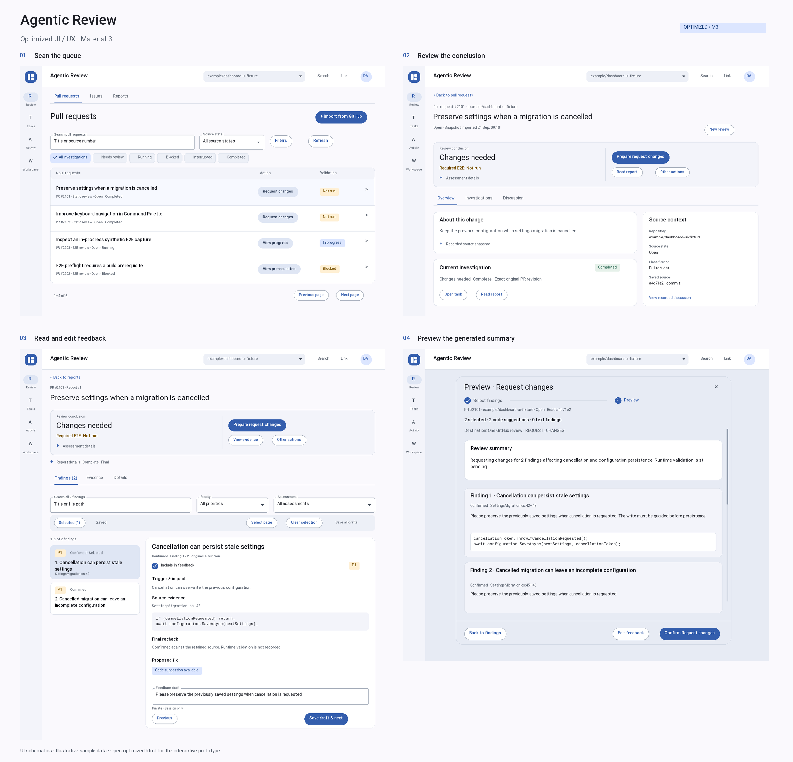

# Optimized frontend UI / UX

Open [the optimized interactive prototype](optimized.html) for working controls,
navigation, forms, dialogs, drafts, and simulated results.

| Screen | Illustration | Interactive entry |
| --- | --- | --- |
| Pull requests | [PNG](optimized-screens/pull-requests.png) / [SVG](optimized-screens/pull-requests.svg) | [Open directory](optimized.html#page=pulls) |
| Source detail | [PNG](optimized-screens/pr-detail.png) / [SVG](optimized-screens/pr-detail.svg) | [Open PR #2101](optimized.html#page=pulls&id=2101) |
| Report reader | [PNG](optimized-screens/report.png) / [SVG](optimized-screens/report.svg) | [Open report](optimized.html#page=reports&id=2101&tab=findings) |
| Preview | [PNG](optimized-screens/preview.png) / [SVG](optimized-screens/preview.svg) | In the PR directory, choose Request changes, select findings, then Preview. |

The drawings reflect the optimized content hierarchy: concise list outcomes,
one prominent next operation, collapsed assessment and source details, separate
report selection and publishing edits, and visible dialog actions.

Publication uses Select findings -> Preview -> Confirm. The preview includes a
short automatically generated summary; editing is an optional branch. The former
`compose` illustration filenames point to the updated preview for compatibility.

The illustration layout is authored and condensed for review. It is not an
automated capture, pixel-equivalence assertion, or browser acceptance result.
The interactive entry uses the current `prototype/` source, including the changes
documented in [UX-REVIEW.md](UX-REVIEW.md).

The PNG drawings were visually inspected as artwork. Product browser verification
remains subject to the separate recorded tool limitation.

Regenerate the interactive entry with `compose.py`. Regenerate the illustrations
with `draw_optimized.py` using Python with Pillow and the installed project Roboto
and Roboto Mono font files. The illustration SVGs embed their font faces.
